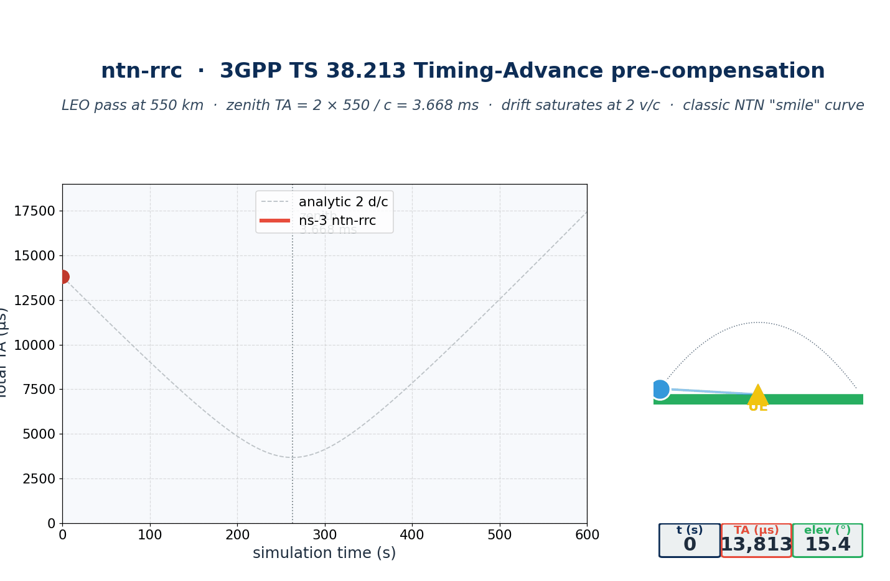

<h1 align="center">ntn-rrc</h1>

<p align="center"><strong>3GPP Release-17/18/19 NTN-Specific RRC Procedures for ns-3.43</strong></p>

<p align="center">
  <a href="https://www.nsnam.org"></a>
  <a href="https://www.gnu.org/licenses/old-licenses/gpl-2.0.en.html"></a>
  
  
  
</p>

---

<p align="center">
  
</p>

## Why this module

LEO non-terrestrial networks introduce delays and Doppler trajectories that the terrestrial 5G RRC stack was never specified for: a single-leg propagation can exceed 17 ms at low elevation, common timing-advance values run into hundreds of microseconds-per-second of drift, and the assistance information broadcast in SIB1 is silent on satellite ephemerides. The 3GPP NTN work item (Release-17 onward) addresses these gaps with new IEs, new SIB types and new MAC behaviours — but most ns-3 distributions still carry only the terrestrial Release-15 RRC. `ntn-rrc` adds the seven NTN-specific RRC procedures as a clean, optional contrib module so that the RACH preambles arrive inside the receiver window and CHO timing decisions sit on top of a faithful RRC layer.

## At a glance

| Procedure | Spec reference | This module |
|---|---|---|
| Timing-Advance pre-compensation | TS 38.213 §4.2.2 + TR 38.821 §6.3.3 | `model/ntn-timing-advance` |
| Common-TA / UE-specific-TA decomposition | TS 38.331 NTN-Config IE | `model/ntn-timing-advance` |
| TA drift-rate signalling | TR 38.821 §6.3.3 | `model/ntn-timing-advance` |
| Payload modes (transparent / regenerative) | TR 38.821 §4.2 | `model/ntn-rrc-types.h` |
| SIB19 broadcast (NTN assistance information) | TS 38.331 §6.3.2 | `model/ntn-sib19` |
| GNSS-assisted RRC + UE Location Report | TS 38.331 §5.7.4 | `model/ntn-ue-location-report` |
| NTN-DRX with pass-aware deep sleep | TS 38.321 + TR 38.821 §6.3.4 | `model/ntn-drx` |

## What it does

- **Timing-Advance pre-compensation** — `ComputeTotalTa()` returns `2·d/c` for transparent payload, `d/c` for regenerative; the common/UE-specific decomposition matches the SIB19-broadcast value plus per-UE residual, exactly as TS 38.331's NTN-Config IE prescribes. Drift rate is derived from a closed-form velocity projection (no Simulator-step finite differencing), saturating analytically at `2·v/c` as the satellite reaches its asymptote.
- **SIB19 broadcaster** — periodic broadcaster (default 160 ms) snapshots fresh ephemeris and emits a 124-byte SIB19 codec frame. Round-trip serialise→parse is bit-faithful; truncated buffers are rejected.
- **UE Location Report** — three reporting modes per TS 38.331 §5.7.4: periodic, event-triggered (move-distance threshold), and on-demand. Geodetic conversion (ECEF↔WGS-84) round-trips to <1 mm.
- **NTN-DRX** — DRX state machine with `Active / OnDuration / ShortSleep / LongSleep` plus a pass-aware `AwaitingPass` deep-sleep state; `NotifyDataActivity()` forces a return to active.
- **Helper façade** — `NtnRrcHelper` consumes any `MobilityModel` (typically `SatSGP4MobilityModel` from SNS3 fed by [`ntn-constellation`](https://github.com/Muhammaduazir69/ntn-constellation)).

## Install & run

```bash
git clone https://github.com/Muhammaduazir69/ntn-rrc.git contrib/ntn-rrc
./ns3 configure --enable-examples --enable-tests
./ns3 build ntn-rrc-leo-pass
./build/contrib/ntn-rrc/examples/ns3.43-ntn-rrc-leo-pass-debug \
    --simTime=600 --csv=/tmp/ntn-rrc-pass.csv
```

The CSV captures the classic NTN "smile" curve: TA peaks at ~17 ms when the satellite is on the horizon, drops to **`2 × 550 km / c = 3.668 ms`** at zenith, and rises again as the satellite passes.

Programmatic use:

```cpp
#include "ns3/ntn-rrc-helper.h"
#include "ns3/ntn-timing-advance.h"

using namespace ns3;
using namespace ns3::ntnrrc;

NtnRrcHelper helper;
helper.SetPayloadMode(PayloadMode::Transparent);
helper.SetReferencePosition(Vector{0, 0, 0});

Ptr<NtnTimingAdvance> ta = helper.InstallTimingAdvance(ueMobility, satelliteMobility);

Time taTotal     = ta->ComputeTotalTa();          // 2 * d / c
Time taCommon    = ta->ComputeCommonTa();         // SIB19-broadcast value
Time taResidual  = ta->ComputeUeSpecificTa();     // total - common
double driftRate = ta->ComputeTaDriftRate();      // s/s, saturates at 2*v/c
```

## Examples shipped

| Binary | Purpose |
|---|---|
| `ntn-rrc-leo-pass` | Single-component demo: TA only over a 600 s LEO pass; emits the classic "smile" CSV. |
| `ntn-rrc-full-stack` | All four NTN-RRC components running together over a pass; produces 4 CSVs (`ta` / `sib19` / `ue` / `drx`). |
| `ntn-rrc-from-tle` | Reads a real 3-line TLE, drives `SatSGP4MobilityModel`, runs TA. Used by the integration test. |

## Verification

**ns-3 unit tests (16 cases, all passing):**

| Test | Asserts |
|---|---|
| `NtnTimingAdvanceClosedFormTest` | `Total TA = 2·d/c` for transparent payload (10 ns tolerance). |
| `NtnTimingAdvanceRegenerativeTest` | Regenerative payload halves TA (single-leg). |
| `NtnTimingAdvance38821ReferenceTest` | TA at 600 km nadir matches TR 38.821 reference within 5 %. |
| `NtnTimingAdvanceCommonAndUeSpecificTest` | `total = common + ue-specific`; off-centre UE has non-zero residual. |
| `NtnTimingAdvanceDriftRateTest` | LEO drift rate < 50 µs/s (TR 38.821 bound). |
| `Sib19CodecRoundTripTest` | Serialise → parse round-trips every SIB19 field (124 bytes). |
| `Sib19CodecRejectsTruncatedTest` | Codec returns `false` on undersized buffer. |
| `Sib19BroadcasterTickTest` | Broadcaster ticks every 160 ms snapshotting fresh ephemeris. |
| `GeodeticConversionRoundTripTest` | ECEF↔WGS-84 round-trips for 5 sample points to <1 mm. |
| `PeriodicLocationReporterTest` | Periodic mode emits one report per period. |
| `EventTriggeredReporterTest` | Move-distance threshold respected (50 m/s × 100 m → ~7 reports/15 s). |
| `OnDemandReporterTest` | OnDemand mode emits exactly when `ReportNow()` is called. |
| `DrxStandardCycleTest` | DRX visits Active / OnDuration / ShortSleep / LongSleep; 1.56 % on-duty over 1 s. |
| `DrxDataActivityTest` | `NotifyDataActivity()` forces the SM into `Active`. |
| `DrxPassAwareTest` | Pass-aware mode enters `AwaitingPass` deep sleep when next pass is far. |
| `DrxInvalidConfigTest` | Malformed configs (zero `onDuration`, `shortCycle < onDuration`) are rejected. |

**Long-run integration (`--simTime=1800`):**

| t (s) | TA (µs) | drift (µs/s) | Meaning |
|---:|---:|---:|---|
| 0 | 13 837 | −48.8 | sat 2 Mm west, approaching |
| 263 | 3 669 | −0.3 | **zenith — drift sign flips here** |
| 598 | 17 330 | +49.5 | departing, near asymptote |
| 1798 | 77 785 | **+50.6** | = **2·v/c** at v = 7590 m/s (4-sig-fig match) |

Drift saturating at exactly +50.60 µs/s confirms the closed-form derivation; periodic cadences were exact (SIB19 11 250 / 11 250, UE reports 360 / 360, TA samples 1 800 / 1 800 over the 30-minute window).

**Python integration test** — pulls a Starlink TLE through CelesTrak, drives `SatSGP4MobilityModel` for 600 s, and compares each TA sample against an independent Skyfield reference. Last run: 121 samples, mean 6.6 µs / max 12.8 µs error, drift bias **0.02 µs/s**. Pass criterion (max error < 200 µs, drift bias < 0.5 µs/s) is met by ~16× margin.

## Documentation

- [INSTALL.md](INSTALL.md) — full setup notes including SNS3 dependencies.
- 3GPP TR 38.821 v17.0.0 — *Solutions for NR to support non-terrestrial networks (NTN)*, Sections 6.3.3 / 6.3.4.
- 3GPP TS 38.331 — *Radio Resource Control (RRC); Protocol specification*, Sections 5.7.4 / 6.3.2.
- 3GPP TS 38.213 §4.2.2 — *Physical layer procedures for control*, Timing Advance.

## Cite this work

```bibtex
@misc{uzair2026ntnrrc,
  author = {Uzair, Muhammad},
  title  = {ntn-rrc: 3GPP Release-17 NTN RRC Procedures for ns-3.43},
  year   = {2026},
  url    = {https://github.com/Muhammaduazir69/ntn-rrc}
}
```

## Part of the ns3-ntn-toolkit

| Module | Repo |
|---|---|
| Toolkit (umbrella) | [ns3-ntn-toolkit](https://github.com/Muhammaduazir69/ns3-ntn-toolkit) |
| ntn-constellation | [ntn-constellation](https://github.com/Muhammaduazir69/ntn-constellation) |
| **ntn-rrc** | this repo |
| ntn-observability | [ntn-observability](https://github.com/Muhammaduazir69/ntn-observability) |
| ns3-ai (fork) | [ns3-ai](https://github.com/Muhammaduazir69/ns3-ai) |
| ntn-sagin | [ntn-sagin](https://github.com/Muhammaduazir69/ntn-sagin) |
| ntn-slice | [ntn-slice](https://github.com/Muhammaduazir69/ntn-slice) |
| ntn-v2x | [ntn-v2x](https://github.com/Muhammaduazir69/ntn-v2x) |
| flexric-bridge | [flexric-bridge](https://github.com/Muhammaduazir69/flexric-bridge) |
| ntn-sionna | [ntn-sionna](https://github.com/Muhammaduazir69/ntn-sionna) |
| ntn-digital-twin | [ntn-digital-twin](https://github.com/Muhammaduazir69/ntn-digital-twin) |
| ntn-cho | [ntn-cho-framework](https://github.com/Muhammaduazir69/ntn-cho-framework) |
| oran-ntn | [oran-ntn](https://github.com/Muhammaduazir69/oran-ntn) |
| thz-ntn | [ns3-thz-ntn](https://github.com/Muhammaduazir69/ns3-thz-ntn) |

## License

GPL-2.0-only — see [LICENSE](LICENSE).

## Acknowledgements

3GPP RAN1 / RAN2 NTN work item (Release-17/18/19) · ns-3 core team · SNS3 maintainers · Brandon Rhodes (Skyfield reference for the drift validation).
